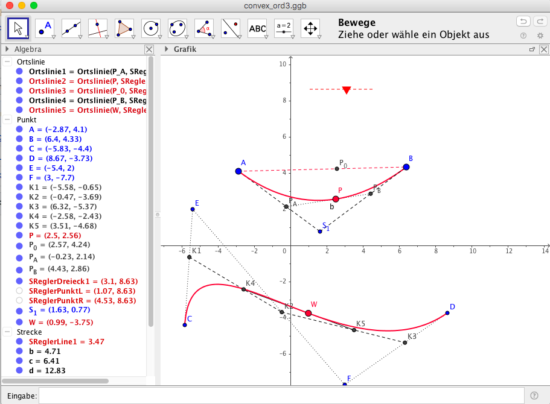

# Geogebra Convex Combination
The repository contains Geogebra Convex Combinations used for Lectures to explain the basic concept of smooth interpolation by application of specific Linear Combinations.

## Wikiversity on Convex Combinations
See Wikiversity Learning Module about Convex Combinations
 

[german Wikiversity Article](https://de.wikiversity.org/wiki/Konvexkombination)

## wxMaxima
[wxMaxima]()
